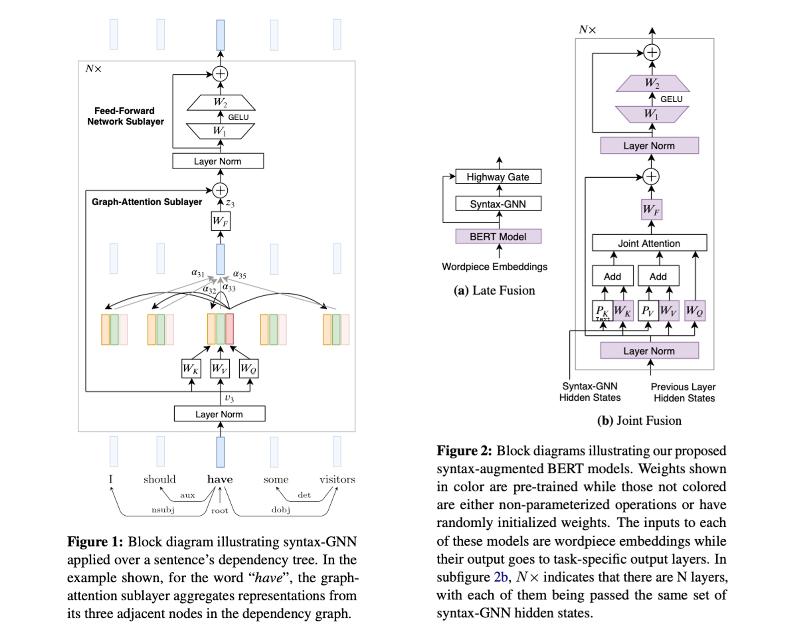

Syntax-Augmented BERT Models
============================

This repo contains authors' original implementation for the paper [Do Syntax Trees Help Pre-trained Transformers Extract Information?](https://arxiv.org/abs/2008.09084) In this work, we explore different methods for adding syntactic structures into existing pretrained Transformer models, and evaluate their effectiveness on SRL, NER and relation extraction tasks.



---

### Reproduce results on the CoNLL-2005 SRL task using `bert-base` weights

### Steps
* Download BERT/RoBERTa model weights from Huggingface by running the command
```
bash download_bert_model.sh
```
This script will create a directory "*hf-bert-weights*" and download the weights of four models. 
Warning: The size of the directory would

* Create a virtualenv named `pyt` using python3.6+ as
```
python3.6+ -m venv $HOME'/.virtualenvs/pyt'
```
Install the dependencies from the `requirements.txt` file as
```
pip install -r requirements.txt
```

* Include the CoNLL-2005 SRL task dataset under the `datasets` directory. 
As the distribution of this dataset is not freely allowed, for reference, this codebase includes 1000 lines for each files contained in the dataset.  

* Now, run the provided script `run_conll_srl.sh` as:
```
bash run_conll_srl.sh
```
Also, make sure that the variable path settings in lines 12-21 of the above script are correct.

* In case of any confusions, errors or bugs, please report it in the `Issues` section.

### Extras
###### Convert from PTB format to UDv2 format
* Install `PyStanfordDependencies` from my fork at: https://github.com/DevSinghSachan/PyStanfordDependencies
  This fork contains changes to use `UniversalDependenciesConverter` class in StanfordCoreNLPv4.0.0.

### Citation
If you find this code useful, please consider citing our paper as:
```
@inproceedings{sachan-etal-2021-syntax,
    title = "Do Syntax Trees Help Pre-trained Transformers Extract Information?",
    author = "Sachan, Devendra  and
      Zhang, Yuhao  and
      Qi, Peng  and
      Hamilton, William L.",
    booktitle = "Proceedings of the 16th Conference of the European Chapter of the Association for Computational Linguistics: Main Volume",
    month = apr,
    year = "2021",
    address = "Online",
    publisher = "Association for Computational Linguistics",
    url = "https://aclanthology.org/2021.eacl-main.228",
    doi = "10.18653/v1/2021.eacl-main.228"
}```
